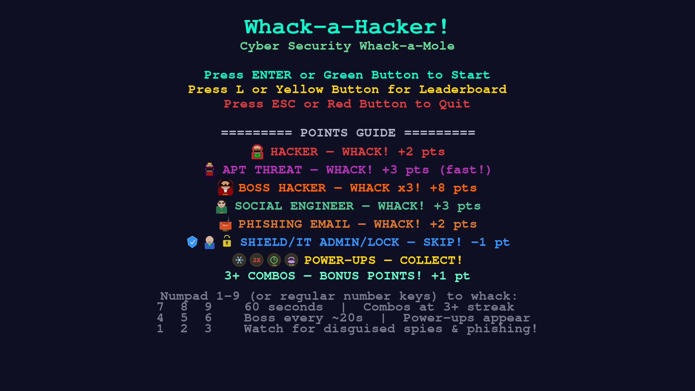

# Whack-a-Hacker

A fast-paced, cyber security themed whack-a-mole game built with Python and Pygame. Defeat hackers, avoid phishing traps, collect power-ups, and climb the leaderboard.



## Features

- **Diverse Enemy Types**: Regular hackers, APT threats, social engineers, and powerful boss hackers.
- **Deceptive Penalties**: Phishing emails that look hostile but penalize you for hitting them.
- **Power-Ups**: Freeze time, double points, add time to the clock, and slow motion.
- **Boss Battles**: Boss hackers appear every ~30 seconds and require 3 hits to defeat.
- **Combo System**: Chain successful hits for bonus points.
- **Procedural Assets**: All sprites and sound effects are generated in code — no external files required.
- **Persistent Leaderboard**: Tracks high scores with stats like accuracy and bosses defeated.
- **Customizable Themes**: Easy to re-theme by changing image paths and colors in the configuration.
- **Mouse Support**: Click to whack with a custom hammer cursor that animates on click.

## Controls

- **Numpad 1-9** (or regular number keys 1-9): Whack the corresponding hole

<table>
  <tr>
    <td> 7 </td>
    <td> 8 </td>
    <td> 9 </td>
  </tr>
  <tr>
    <td> 4 </td>
    <td> 5 </td>
    <td> 6 </td>
  </tr>
  <tr>
    <td> 1 </td>
    <td> 2 </td>
    <td> 3 </td>
  </tr>
</table>

- **Mouse Click**: Whack holes directly with the cursor (hammer cursor appears during gameplay)
- **Enter / Numpad Enter**: Start game / Play again / Confirm name
- **L**: View leaderboard
- **M**: Return to menu
- **ESC**: Quit game / Return to menu
- **Ctrl+Shift+C**: Reset leaderboard

## Installation

### Option 1: Install via apt (Recommended)

```bash
sudo apt update
sudo apt install python3-pygame
```

### Option 2: Use pip with virtual environment

```bash
# Install venv support if not already installed
sudo apt install python3-full

# Clone or download the game
git clone https://github.com/yourusername/whack-a-hacker.git
cd whack-a-hacker

# Create and activate virtual environment
python3 -m venv venv
source venv/bin/activate

# Install pygame
pip install pygame

# Run the game
python3 main.py
```

### Option 3: Force pip installation (Not recommended)

```bash
pip3 install pygame --break-system-packages
```

## Running the Game

```bash
python3 main.py
```

The game runs at 60 FPS and is optimized for modern systems. No external assets are required — all sprites and sounds are procedurally generated at startup.

## Game Mechanics

### Scoring

| Entity | Points | Notes |
|--------|--------|-------|
| Hacker | +2 | Standard enemy |
| APT Threat | +3 | Advanced Persistent Threat, faster |
| Social Engineer | +3 | Disguised as friendly |
| Boss Hacker | +8 | Requires 3 hits to defeat |
| Friendly (Shield/Admin/Lock) | -1 | Penalty for hitting |
| Phishing Email | -2 | Traps that look hostile |

### Power-Ups

- **Freeze** (❄️): Freezes all active moles for 3 seconds
- **Double Points** (2X): Doubles all points for 5 seconds
- **Time Bonus** (+5s): Adds 5 seconds to the game clock
- **Slow Motion** (🐌): Moles stay visible 50% longer for 4 seconds

### Difficulty Progression

- Game starts with 2 simultaneous moles max
- Every 15 seconds, spawn rate increases and max active moles increases
- Moles appear for shorter durations as difficulty ramps up
- Boss hackers appear at 25 seconds, then every 30 seconds

## Customization

The game is designed to be easily re-themed. Edit the configuration section at the top of `main.py`:

```python
# Change game title and duration
GAME_TITLE = "Whack-a-Hacker"
GAME_DURATION = 90

# Define custom images (optional)
MOLE_IMAGE_PATHS = {
    "hacker": ["assets/my_hacker1.png", "assets/my_hacker2.png"],
    "boss": ["assets/my_boss.png"],
}
FRIENDLY_IMAGE_PATHS = {
    "shield": ["assets/my_shield.png"],
    "lock": ["assets/my_lock.png"],
}

# Adjust colors
C_BG = (15, 15, 35)
C_TEXT = (0, 255, 200)
```

### Adding Custom Assets

1. Create an `assets/` folder in the game directory
2. Add your PNG images (80x80 pixels recommended)
3. Update the image path variables in the configuration
4. The game will load your images if they exist, otherwise uses procedural sprites

## Leaderboard

High scores are saved to `leaderboard.json` in the game directory. The leaderboard tracks:

- Score
- Player name
- Maximum combo achieved
- Accuracy percentage
- Bosses defeated
- Date of achievement

## Troubleshooting

### "externally-managed-environment" Error

This occurs on newer Raspberry Pi OS versions. See the Installation section for solutions.

### Audio Not Working

The game will run without sound if Pygame audio initialization fails. All sound effects are generated procedurally at startup, so no external audio files are needed.

### Performance Issues

The game is optimized to run at 60 FPS. If you experience slowdown:

- Ensure you're running Python 3.8 or newer
- Try installing pygame via `apt` instead of pip
- Close other applications to free up resources

## Contributing

Contributions are welcome! Feel free to submit pull requests for:

- New enemy types
- Additional power-ups
- Theme variations
- Bug fixes
- Performance improvements

## License

This project is released under the MIT License. Feel free to modify and redistribute as you see fit.

## Acknowledgments

- Built with [Pygame](https://www.pygame.org/)
- Sound effects generated using mathematical waveforms
- Sprites generated procedurally using Pygame drawing functions
- Inspired by classic arcade whack-a-mole games
