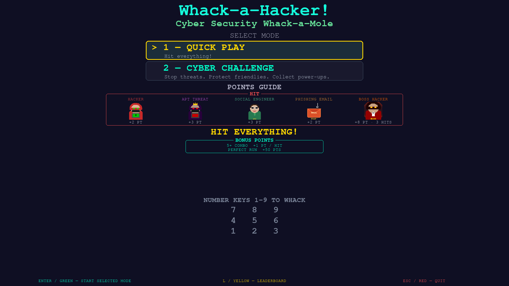
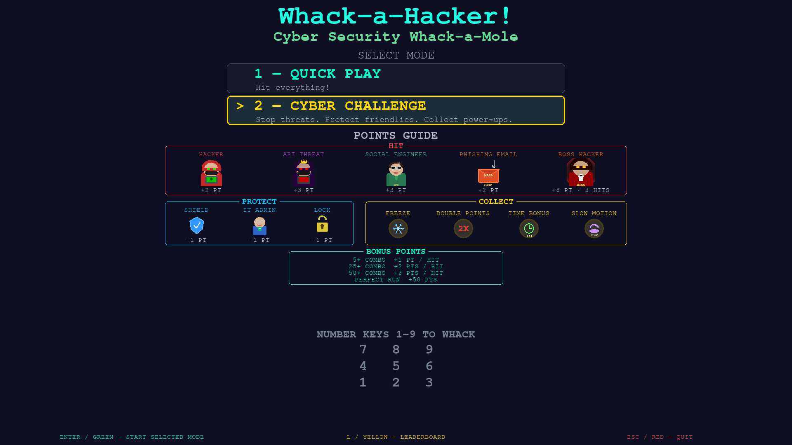

# Whack-a-Hacker

A fast-paced, cyber security themed whack-a-mole game built with Python and Pygame. Stop cyber threats, master combos, and climb the leaderboard.

- [Whack-a-Hacker](#whack-a-hacker)
  - [Quick Start](#quick-start)
  - [Features](#features)
  - [Documentation](#documentation)
  - [Game Modes](#game-modes)
    - [Quick Play](#quick-play)
    - [Cyber Challenge](#cyber-challenge)
  - [Game Mechanics](#game-mechanics)
    - [Scoring](#scoring)
      - [Enemy Points](#enemy-points)
      - [Friendly Penalties](#friendly-penalties)
      - [Combo Bonus](#combo-bonus)
    - [Power-Ups](#power-ups)
    - [Difficulty Progression](#difficulty-progression)
  - [Leaderboard](#leaderboard)
  - [License](#license)
  - [Acknowledgments](#acknowledgments)

## Quick Start

```bash
git clone https://github.com/commputethis/Whack-a-Hacker.git
cd whack-a-hacker
python3 main.py
```

## Features

- Diverse Enemy Types: Regular hackers, APT threats, social engineers, powerful boss hackers, and phishing emails
- Two Game Modes: Welcoming Quick Play and the full Cyber Challenge experience
- Power-Ups: Freeze time, double points, add time to the clock, and slow motion
- Boss Battles: Boss hackers appear every ~30 seconds and require 3 hits to defeat
- Combo System: Chain consecutive hits for bonus points starting at 3 hits in a row
- Procedural Assets: All sprites and sound effects are generated in code — no external files required
- Persistent Leaderboard: Ranks players by score and tracks competitive stats such as maximum combo, bosses defeated, and friendlies hit
- Customizable Themes: Easy to re-theme by changing image paths, colors, and text
- Mouse Support: Click to whack with a custom hammer cursor that animates on click

## Documentation

- [Installation Guide](./docs/INSTALL.md) — Setup instructions for Linux, Windows, and macOS
- [Controls & Gamepad](./docs/CONTROLS.md) — Keyboard controls and DIY hardware gamepad build
- [Customization](./docs/CUSTOMIZATION.md) — Themes, custom sprites, and configuration
- [Troubleshooting](./docs/TROUBLESHOOTING.md) — Common issues and solutions
- [Building from Source](./docs/BUILD.md) — Build your own AppImage and development tools

## Game Modes

### Quick Play

Quick Play is the beginner-friendly mode: every target should be hit. It includes
all threat types, bosses, combos, and normal difficulty progression, with no
friendlies or power-ups to worry about.

[](images/Quick_Play_MenuScreenshot.png)

### Cyber Challenge

Cyber Challenge is the full game experience. Identify and stop threats, protect
friendlies, collect power-ups, and build combos for bonus points. Avoiding every
friendly also earns a Clean Run.

[](images/Cyber_Challenge_MenuScreenshot.png)

On the menu, use **Up/Down** or press **1** for Quick Play and **2** for Cyber
Challenge, then press **Enter / Green** to start. Selecting a mode does not start
it immediately. The illustrated Points Guide updates with the selected mode.

## Game Mechanics

### Scoring

#### Enemy Points

| Enemy | Base Points | Hits Required | Notes |
| ----- | ----------- | ------------- | ----- |
| Hacker | +2 | 1 | Standard threat |
| APT | +3 | 1 | Faster spawn/despawn |
| Social Engineer | +3 | 1 | Looks like friendly |
| Phishing Email | +2 | 1 | Block the attack |
| Boss Hacker | +8 | 3 | Spawns every ~30 seconds |

#### Friendly Penalties

| Target | Penalty | Reason |
| ------ | ------- | ------ |
| Shield | -1 | Don't hit defenses! |
| IT Admin | -1 | Protect your allies |
| Lock | -1 | Security is friend, not food |

#### Combo Bonus

Quick Play uses one combo tier:

- Combo 5+: +1 bonus point per successful scoring hit.
- The fifth hit earns the first bonus point, and the tier restarts after a
  broken streak.

Cyber Challenge uses three non-cumulative combo tiers:

- Combo 5-24: +1 bonus point per successful scoring hit.
- Combo 25-49: +2 bonus points per successful scoring hit.
- Combo 50+: +3 bonus points per successful scoring hit.

Only the highest applicable Cyber Challenge tier is awarded for each hit. A
50+ combo therefore earns +3, not +1 +2 +3.

#### Perfect Run

A Perfect Run adds **+50 points** in either mode.

- In Quick Play, earn it by missing no required enemy hits and fully defeating
  every boss with all three hits.
- In Cyber Challenge, the same enemy and boss requirements apply, and zero
  friendlies may be hit. Power-ups are excluded: collecting, missing, or
  ignoring one does not affect Perfect Run.
- Pressing an empty hole does not affect Perfect Run in either mode.

Cyber Challenge's **Clean Run** still means zero friendlies hit. Perfect Run is
stricter because it also requires that no required enemy hits were missed.

The final score, including all combo and Perfect Run bonuses, is calculated
before leaderboard qualification. The Game Over screen shows the actual combo
bonus points earned in each tier across all streaks.

### Power-Ups

- **Freeze** (❄️): Freezes all active moles for 3 seconds
- **Double Points** (2X): Doubles all points for 5 seconds
- **Time Bonus** (+5s): Adds 5 seconds to the game clock
- **Slow Motion** (🐌): Moles stay visible 50% longer for 4 seconds

### Difficulty Progression

- Game starts with 2 simultaneous moles max
- Every 15 seconds, spawn rate increases and max active moles increases
- Moles appear for shorter durations as difficulty ramps up
- Boss hackers appear at 25 seconds, then every 30 seconds

## Leaderboard

High scores are saved to `~/.local/share/whack-a-hacker/leaderboard.json` on your
system. Quick Play and Cyber Challenge have separate score-ranked views because
their scores are not directly comparable. Each entry tracks:

- Player name
- Score (the primary ranking metric)
- Maximum combo achieved
- Bosses defeated
- Friendlies hit
- Date of achievement

Press **L / Yellow** on the menu to open the selected mode's leaderboard. On a
leaderboard, the same **L / Yellow** input switches modes, **Enter / Green** starts
the displayed mode, and **Escape / Red** returns to the menu. Yellow is not a
separate input: the arcade button sends the letter `L`.

Leaderboard records created before modes were introduced are treated as Cyber
Challenge scores. New entries record their mode, while legacy files remain usable
without migration.

Accuracy is no longer recorded or displayed. The Game Over screen instead gives
detailed performance feedback, including hackers whacked and missed, friendlies
hit, threats stopped, bosses defeated, power-ups collected, and maximum combo.
A **Clean Run** is awarded only in Cyber Challenge when no friendlies are hit; it
is a visual achievement only and does not affect score or leaderboard ranking.
Perfect Run is a separate, stricter achievement that awards the scoring bonus
described above.

## License

- MIT License — See [LICENSE](LICENSE) for details.

## Acknowledgments

- Built with Pygame
- Sound effects generated using mathematical waveforms
- Sprites generated procedurally using Pygame drawing functions
